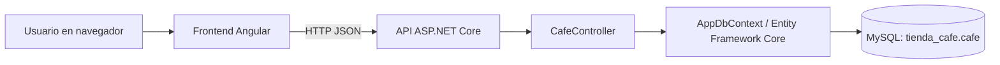

# Documentación técnica del proyecto Café Premium

## 1. Propósito

Café Premium es un proyecto web local para administrar un catálogo de café. Está compuesto por una interfaz Angular, una API REST en ASP.NET Core y una base de datos MySQL. Desde la interfaz se consultan los registros de café, se crean nuevos productos, se editan y se eliminan. La pantalla de login existe como una base visual para una etapa posterior; todavía no autentica usuarios ni conecta con Google.

La documentación cubre la versión que está en estas carpetas:

- Backend y API: `API_CON_DB/`.
- Frontend: `../diseño web/primer_proyecto/`.
- Base de datos: `tienda_cafe`, con la tabla `cafe`.

## 2. Arquitectura



El frontend no accede directamente a MySQL. Envía solicitudes HTTP al backend; el backend valida los datos y consulta o modifica MySQL usando Entity Framework Core.

### Tecnologías principales

- **Frontend:** Angular 22, TypeScript, Angular Router, FormsModule y Bootstrap 5.
- **Renderizado:** Angular SSR/prerender, con las rutas del catálogo y login generadas durante la compilación.
- **Backend:** ASP.NET Core 10 y controladores Web API.
- **Persistencia:** Entity Framework Core con el proveedor `MySql.EntityFrameworkCore`.
- **Base de datos:** MySQL, base `tienda_cafe`.

## 3. Estructura de carpetas

### Backend

| Ruta | Responsabilidad |
|---|---|
| `API_CON_DB/Program.cs` | Configuración, CORS, conexión a MySQL y registro de controladores. |
| `API_CON_DB/Controllers/CafeController.cs` | Endpoints REST para listar, crear, consultar por ID, actualizar y eliminar cafés. |
| `API_CON_DB/Models/Cafe.cs` | Modelo y mapeo de la entidad a la tabla `cafe`. |
| `API_CON_DB/DB/AppDbContext.cs` | Contexto de EF Core y conjunto `Cafes`. |
| `API_CON_DB/appsettings.example.json` | Ejemplo de configuración sin credenciales reales. |
| `API_CON_DB/appsettings.secrets.json` | Configuración local privada; no debe subirse al repositorio. |
| `API_CON_DB/Properties/launchSettings.json` | Perfiles locales `http` y `https` para Visual Studio y `dotnet run`. |
| `API_CON_DB_Documentacion.md` | Referencia breve de la API y ejemplos para Postman. |

### Frontend

| Ruta | Responsabilidad |
|---|---|
| `src/app/app.routes.ts` | Rutas `/catalogo` y `/login`. |
| `src/app/pages/home/` | Tienda, formulario del CRUD, búsqueda y tarjetas del inventario. |
| `src/app/pages/login/` | Pantalla inicial de login sin autenticación implementada. |
| `src/app/Services/cafe.service.ts` | Solicitudes HTTP a `/api/cafe`. |
| `src/app/Models/cafe.ts` | Tipos TypeScript del café y del formulario. |
| `src/environments/environment.development.ts` | URL de la API para desarrollo. |
| `src/environments/environment.ts` | URL de la API en compilación de producción. |
| `src/styles.css` | Importación global de Bootstrap 5. |

## 4. Modelo de datos

La tabla `cafe` debe existir en la base `tienda_cafe`. La aplicación espera que sus nombres y tipos coincidan con este esquema:

| Columna | Tipo MySQL | Reglas y uso |
|---|---|---|
| `id` | `INT` | Clave primaria, autoincremental. |
| `cafe` | `VARCHAR(120)` | Nombre comercial; obligatorio. |
| `especialidad` | `VARCHAR(120)` | Especialidad o variedad; obligatorio. |
| `presentacion` | `VARCHAR(80)` | Presentación del producto; obligatoria. |
| `origen` | `VARCHAR(120)` | Región de origen; obligatoria. |
| `cantidad` | `INT` | Unidades disponibles; cero o más. |
| `valor` | `DECIMAL(10,2)` | Precio en COP; cero o más. |
| `descripcion` | `TEXT` | Información adicional; opcional. |

SQL de referencia para una instalación vacía:

```sql
CREATE DATABASE IF NOT EXISTS tienda_cafe
  CHARACTER SET utf8mb4
  COLLATE utf8mb4_unicode_ci;

USE tienda_cafe;

CREATE TABLE IF NOT EXISTS cafe (
  id INT NOT NULL AUTO_INCREMENT,
  cafe VARCHAR(120) NOT NULL,
  especialidad VARCHAR(120) NOT NULL,
  presentacion VARCHAR(80) NOT NULL,
  origen VARCHAR(120) NOT NULL,
  cantidad INT NOT NULL DEFAULT 0,
  valor DECIMAL(10,2) NOT NULL DEFAULT 0.00,
  descripcion TEXT NULL,
  PRIMARY KEY (id)
) ENGINE=InnoDB DEFAULT CHARSET=utf8mb4 COLLATE=utf8mb4_unicode_ci;
```

Si la base y tabla ya existen, no es necesario recrearlas. Confirma en MySQL Workbench que `id` tenga `AUTO_INCREMENT` y que las columnas coincidan. El modelo de la aplicación usa `[Table("cafe")]` y mapea explícitamente los nombres de columna.

### Migraciones

Las migraciones incluidas en `API_CON_DB/Migrations/` pertenecen al modelo anterior `Productos`. No ejecutes `dotnet ef database update` contra `tienda_cafe`: la tabla actual se preparó manualmente y esas migraciones no representan el esquema vigente.

## 5. Configuración de la conexión

La API busca la cadena de conexión `DefaultConnection`, con prioridad en la variable de entorno:

```text
ConnectionStrings__DefaultConnection
```

Ejemplo de formato —reemplaza `TU_CLAVE` por la clave local de MySQL—:

```text
Server=localhost;Database=tienda_cafe;User=root;Password=TU_CLAVE;SslMode=Disabled;AllowPublicKeyRetrieval=True;
```

### Configurar desde PowerShell

Para guardarla para futuras sesiones:

```powershell
setx ConnectionStrings__DefaultConnection "Server=localhost;Database=tienda_cafe;User=root;Password=TU_CLAVE;SslMode=Disabled;AllowPublicKeyRetrieval=True;"
```

Después de ejecutar `setx`, cierra y vuelve a abrir Visual Studio o la terminal. Para la sesión actual únicamente:

```powershell
$env:ConnectionStrings__DefaultConnection = "Server=localhost;Database=tienda_cafe;User=root;Password=TU_CLAVE;SslMode=Disabled;AllowPublicKeyRetrieval=True;"
```

También puedes copiar `API_CON_DB/appsettings.example.json` como `API_CON_DB/appsettings.secrets.json` y modificarlo localmente. Ese archivo privado se excluye del control de versiones. Nunca incluyas una contraseña real en documentación pública, capturas, `appsettings.json` o commits.

El usuario de MySQL necesita permisos `SELECT`, `INSERT`, `UPDATE` y `DELETE` en `tienda_cafe.cafe`.

## 6. Cómo iniciar el proyecto

La base de datos, el backend y el frontend son procesos separados. MySQL debe estar activo; también deben quedar abiertas las terminales del backend y del frontend mientras se usa la aplicación.

### Opción A: Visual Studio para el backend

1. Abre `API_CON_DB.slnx`.
2. Selecciona `API_CON_DB` como proyecto de inicio.
3. En los perfiles de ejecución, selecciona `http`.
4. Presiona **F5** o **Ctrl+F5**.
5. Comprueba la API en `http://localhost:5031/api/cafe`.

Visual Studio inicia el backend; no inicia automáticamente el frontend Angular. Abre otra terminal para ejecutar Angular.

### Opción B: PowerShell para el backend

Desde `DISEÑO-WEB/API_CON_DB`:

```powershell
dotnet restore
dotnet run --project .\API_CON_DB\API_CON_DB.csproj
```

La API usa normalmente `http://localhost:5031` con el perfil `http`.

### Iniciar el frontend

Desde `DISEÑO-WEB/diseño web/primer_proyecto`:

```powershell
npm install
npm start
```

Angular usa por defecto `http://localhost:4200`. Si el puerto está ocupado, usa otro libre, por ejemplo:

```powershell
npm start -- --host 127.0.0.1 --port 4201
```

En ese caso abre `http://127.0.0.1:4201/catalogo`. La API permite orígenes locales `localhost` y `127.0.0.1` en los puertos 4200 y 4201.

Para compilar el frontend:

```powershell
npm run build
```

El comando `npm start` inicia el servidor de desarrollo con recarga de cambios; para desarrollo normalmente no hace falta ejecutar `npm run build` después de cada modificación.

## 7. Uso del frontend

### Catálogo

La ruta principal es `/catalogo`; la raíz `/` redirige al catálogo. La tienda muestra productos en tarjetas, campo de búsqueda, cantidad disponible, precio en pesos colombianos y origen.

- **Agregar café:** pulsa `Agregar café` para mostrar el formulario junto al inventario.
- **Crear:** completa los datos obligatorios y pulsa `Publicar café`.
- **Editar:** pulsa `Editar` en la tarjeta del producto, modifica los campos y guarda los cambios.
- **Eliminar:** pulsa `Eliminar producto` y confirma la acción del navegador.
- **Buscar:** escribe nombre, especialidad, presentación, origen o descripción en el campo de búsqueda.
- **Actualizar catálogo:** usa el botón de recarga para volver a consultar la API.

El formulario requiere café, especialidad, presentación y origen. Cantidad debe ser un entero no negativo y valor no puede ser negativo. La descripción es opcional.

### Login

La ruta `/login` muestra una pantalla inicial. El botón de Google es solo visual y está deshabilitado; no hay autenticación, tokens, perfiles de usuario ni protección de rutas configurados en backend.

### Bootstrap

Bootstrap 5 está instalado e importado globalmente desde `src/styles.css`. La tienda combina utilidades y componentes de Bootstrap con estilos propios para el catálogo, el formulario y las tarjetas.

## 8. API REST

Base URL local:

```text
http://localhost:5031
```

La API recibe y devuelve JSON. Endpoints:

| Método | Ruta | Descripción | Respuesta correcta |
|---|---|---|---|
| `GET` | `/api/cafe` | Lista todos los cafés. | `200 OK` y arreglo JSON. |
| `GET` | `/api/cafe/{id}` | Consulta un café por ID. | `200 OK` o `404 Not Found`. |
| `POST` | `/api/cafe` | Crea un café. | `201 Created` con el registro creado. |
| `PUT` | `/api/cafe/{id}` | Actualiza un café. El ID del cuerpo debe coincidir con la ruta. | `204 No Content`. |
| `DELETE` | `/api/cafe/{id}` | Elimina un café. | `204 No Content`. |

En entorno Development está habilitado OpenAPI en `/openapi/v1.json`.

### Ejemplo: crear café

En Postman selecciona **POST**, usa `http://localhost:5031/api/cafe`, y en **Body → raw → JSON** envía:

```json
{
  "cafe": "Café de origen",
  "especialidad": "Arábica lavado",
  "presentacion": "Bolsa de 500 g",
  "origen": "Antioquia, Colombia",
  "cantidad": 10,
  "valor": 35000.00,
  "descripcion": "Tostión media, notas dulces"
}
```

No envíes `id` al crear: MySQL lo genera automáticamente.

### Ejemplo: actualizar café

Envía `PUT http://localhost:5031/api/cafe/2` con el registro completo y el mismo ID en el cuerpo:

```json
{
  "id": 2,
  "cafe": "Café de origen",
  "especialidad": "Arábica lavado",
  "presentacion": "Bolsa de 500 g",
  "origen": "Antioquia, Colombia",
  "cantidad": 8,
  "valor": 36000.00,
  "descripcion": "Actualización del inventario"
}
```

### Ejemplo: consultar y eliminar

```text
GET    http://localhost:5031/api/cafe
GET    http://localhost:5031/api/cafe/2
DELETE http://localhost:5031/api/cafe/2
```

Incluye `Content-Type: application/json` en las solicitudes que envían cuerpo.

## 9. Cómo viaja una operación

Ejemplo de creación desde la página:

1. Angular valida los campos y normaliza espacios con `trim()`.
2. `CafeService.createCafe()` envía `POST /api/cafe` con JSON.
3. CORS acepta el origen local del frontend.
4. ASP.NET Core enlaza el JSON con el modelo `Cafe` y valida anotaciones como campos requeridos y rangos numéricos.
5. `CafeController.Create()` agrega el modelo al `AppDbContext` y ejecuta `SaveChangesAsync()`.
6. Entity Framework Core inserta el registro en MySQL.
7. La API responde `201 Created`; Angular muestra confirmación y vuelve a consultar `GET /api/cafe`.

Edición y eliminación siguen el mismo flujo con `PUT` y `DELETE`.

## 10. Configuración de CORS y SSR

El backend declara una política CORS para el frontend local:

- `http://localhost:4200`
- `http://localhost:4201`
- `http://127.0.0.1:4200`
- `http://127.0.0.1:4201`

Si usas otro host o puerto, agrega el origen específico a la política `AllowAngularApp` de `API_CON_DB/Program.cs` y reinicia el backend.

Angular SSR valida los hosts entrantes. En `angular.json`, `security.allowedHosts` incluye `localhost` y `127.0.0.1`. Si agregas un dominio nuevo (por ejemplo, un nombre local distinto), agrégalo a esa lista. Angular describe esta allowlist como protección contra solicitudes SSRF; evita reemplazarla por `*` en un servidor público.

## 11. Errores frecuentes

### La API falla al iniciar por la conexión

Confirma que MySQL esté ejecutándose, que exista la base `tienda_cafe`, que la tabla `cafe` tenga el esquema indicado y que la variable `ConnectionStrings__DefaultConnection` esté disponible en el proceso que inicia el backend.

### `500 Internal Server Error` al consultar o guardar

Revisa la consola del backend. Las causas comunes son una columna con nombre o tipo distinto, tabla inexistente, contraseña incorrecta o permisos insuficientes.

### El navegador no carga datos o muestra un error de CORS

Confirma que API y frontend estén activos. Comprueba que `src/environments/environment.development.ts` apunte a `http://localhost:5031/api/`, que el origen de Angular esté permitido en CORS y que el navegador abra el host y puerto correctos.

### Error `No se puede obtener /catalogo` o respuesta 400 de host

Puede haber un proceso viejo o incorrecto usando el puerto seleccionado. Verifica qué puerto muestra `ng serve` o el servidor SSR al arrancar y abre exactamente esa dirección. Para errores 400 SSR, verifica `security.allowedHosts` en `angular.json`.

### `dotnet run` dice que no encuentra el proyecto

Ejecuta el comando desde la raíz `API_CON_DB`, o indica la ruta completa relativa:

```powershell
dotnet run --project .\API_CON_DB\API_CON_DB.csproj
```

### `dotnet build` no puede copiar el ejecutable

Si la API está ejecutándose, Windows puede bloquear el archivo de salida. Detén la API con Ctrl+C en su terminal, compila y vuelve a iniciarla.

## 12. Límites y siguientes pasos

- El login de Google todavía no está implementado.
- La API no tiene autenticación ni autorización por usuario.
- El formulario de administración del catálogo se muestra en el frontend; no hay panel de permisos.
- La tabla `cafe` se administra manualmente en MySQL; las migraciones antiguas no deben aplicarse al esquema actual.
- Para publicar el proyecto en Internet hacen falta configuración de producción, HTTPS, gestión segura de secretos, controles de acceso y políticas de respaldo.

## 13. Referencias dentro del proyecto

- [README del backend](./README.md)
- [Documentación de endpoints y Postman](./API_CON_DB_Documentacion.md)
- [Proyecto Angular](../diseño%20web/primer_proyecto/README.md)
